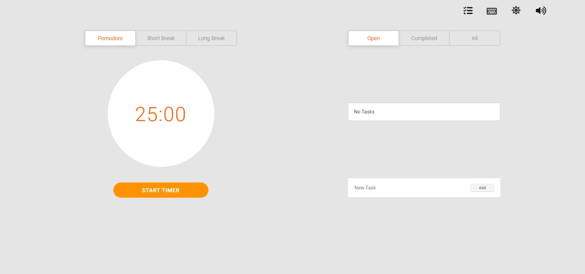

# Pomodoro Timer

:tomato: Pomodoro timer built with React

## Features

1. Pomodoro Timer
2. Built-in notes
3. Minimalistic and clean interface
4. Dark mode support
5. HTML5 Notification
6. Keyboard Shortcuts

## Themes

* Light
  
* Dark
  

## Running Locally

```sh
npm install
npm start
```

Runs the app in development mode.

Open [localhost:3000](http://localhost:3000) to view it in the browser.
